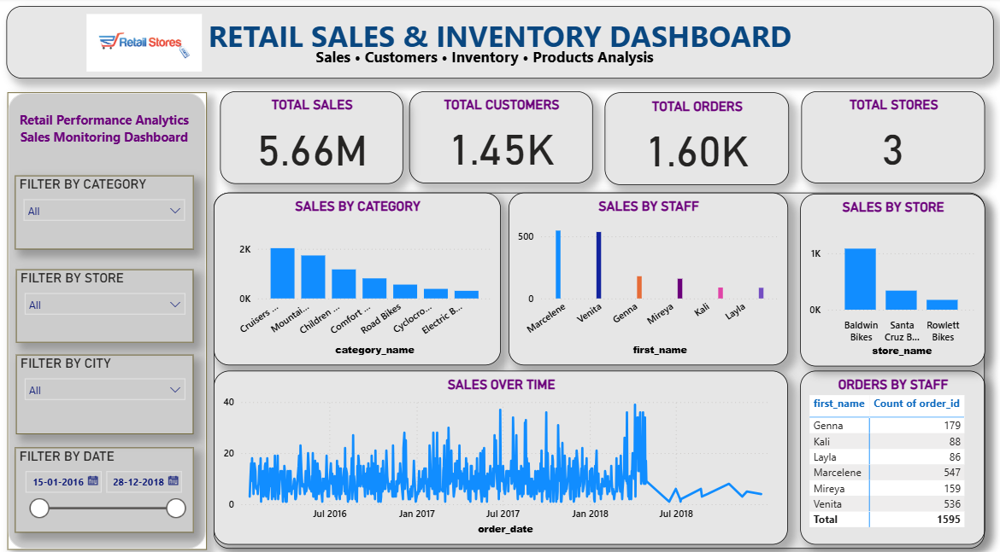

# 🛒 RETAIL SALES & INVENTORY DASHBOARD

## 📌 Project Overview
This project is developed using SQL Server and Power BI for retail business intelligence and sales analysis.

The dashboard helps analyze:
- Total Sales
- Total Orders
- Customer Analysis
- Store Performance
- Staff Performance
- Sales Trends Over Time

---

## ⚙️ Tools & Technologies Used
- SQL Server
- Power BI
- DAX
- Data Visualization
- Business Intelligence

---

## 📊 Dashboard Features
- KPI Cards
- Sales by Category
- Sales by Store
- Sales by Staff
- Sales Over Time
- Interactive Slicers

---

## 🖼️ Dashboard Screenshot

---

## 🎥 Project Demo Video
Paste your YouTube video link here

---

## 📁 Dataset Files
The repository also contains retail dataset CSV files and SQL queries used for analysis.

---

## 👨‍💻 Developed By
Md Sahanwaj Khan
